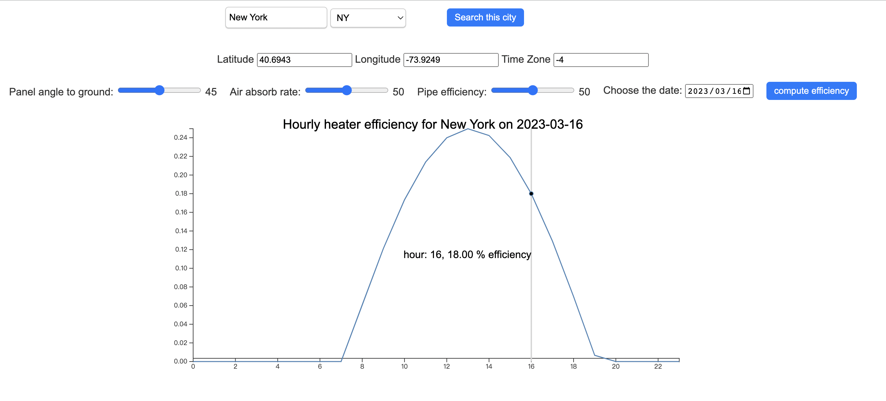

# solar water heater simulation

## Demo

As images need to be downloaded from Docker Hub and external APIs need to be accessed, please ensure that the host running the program is connected to the internet.

To run the web app, please first make sure the docker is activated, and then download the <code>docker-compose.yml</code> file in this repo. In the same directory where <code>docker-compose.yml</code> is, run the commands:

```console
docker-compose up -d # start the services
```
The docker will automatically download the two image for backend and frontend from [docker hub](https://hub.docker.com/repository/docker/jw979/solar-heater/general).

The frontend will then be running on <code>http://localhost:8080/</code>, 
and the backend will be running on <code>http://localhost:8000/</code>.

Sometimes the external API may takes some time to response, pease allow it few seconds.

<br>
To stop the web app, run the command.

```console
docker-compose down # stop the services
```
<br>

## Usage Instructions

This system calculates the hourly solar energy conversion ratio of a solar water heater based on user input.



When the system starts, a frontend will be build on user's browser. Users can first search for the target city(must be within US) and then input other information of the system to get the total solar energy conversion efficiency of the water heater system for that city on certain day.

<br>

## Main Logic

Several factors affect the conversion efficiency, including the efficiency of the solar panel and the efficiency of heating the water storage tank by the pipes. Each of these factors can be further subdivided into many factors. For example, weather conditions, the conversion efficiency of the solar panels, and the angle at which the solar panels are placed will all affect the efficiency of the solar heating pipes.

We abstract the efficiency of the pipe to users input and mainly consider the efficiency of the solar panel. We also assume that the efficiency of the solar panels' absorption of solar energy and the conversion of heat to the pipes is 100%. Furthermore, we abstract weather conditions as the absorption rate of the air for solar energy, which we made to be determined by user input.

Considering the impact of the angle of incidence. By researching [online](https://hvac-eng.com/solar-angles/#gsc.tab=0) and referring to chapter 3.12 of the book ["Solar Energy Fundamentals and Modeling Techniques"](https://link.springer.com/book/10.1007/978-1-84800-134-3) we have found that the efficiency will be reduced to the cosine value of the incidence angle. 


We convert the solar water heater efficiency into the following expression:

$totalEfficiency = pipeEfficiency \times (1 - airAbsortionRate) \times cos(incidenceAngle)$


And the fromular for calculating the incidence angle $\theta$ is:

>$cos(\theta) = cos(\beta) \times cos(\gamma) \times sin(\sigma) + sin(\beta) \times cos(\sigma)$

where $\beta$ is the solar altitude, $\sigma$ is the difference between the azimuth, and here as we assume the panle will be facing due south, this could be regarded as pure solar azimuth. $\gamma$ is the panel tilt angle.


For getting the solar altitude and the azimuth, we refer to the [PVLIB API](https://pvfree.azurewebsites.net/pvlib/#solar-position), in this API, with the latitude, longitude, and time difference to UTC and date specified, we could get the solar position information in the target day.

To make the input more user-friendly, we won't let the user input the latitude and longitude, instead, we refer to [United States Cities Database](https://simplemaps.com/data/us-cities) and allow the user to input the target city and get the geolocation accordingly.

<br>

## Code Structure

This system consists of a separate front-end and back-end. The back-end is responsible for receiving responses, retrieving data, and performing calculations, while the front-end is responsible for receiving user inputs and displaying the calculation results.

### Backend
```csharp
backend/
│
├── utils/
├── database/
├── app/
│   ├── controller/
│   ├── data/
│   └── service/
│
├── main.py
└── requirements

```

The backend is build with Flask, there are three main layers in the backend, the controller layer get the request frontend and propagate it to the service layer, and then response with its return. The service layer handle the logic and do the calculation, the data layer interact with the database and call the external API to get the data.

### Frontend
```csharp
frontend/
│
├── index.html
├── lincharts.js
├── script.js
├── style.css
└── package.json

```

The frontend is build with plain HTML, using jQuery for event handling and Ajax. The <code>scripts.js</code> organizes the pages and handles the event, the <code>lincharts.js</code> visualtion the result with mouse hover interaction.

The code is fully commented, please refer to the code for more detailed explanations.